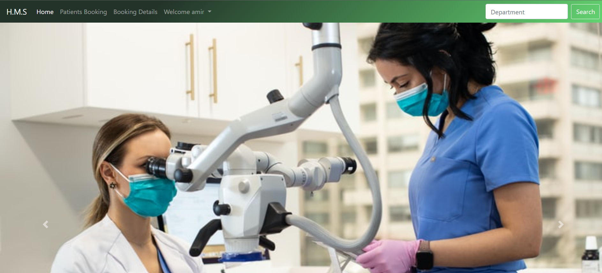
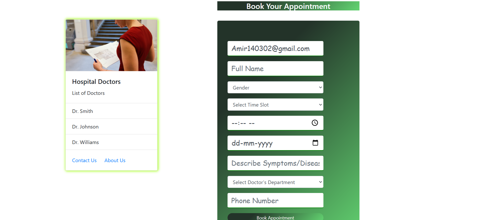
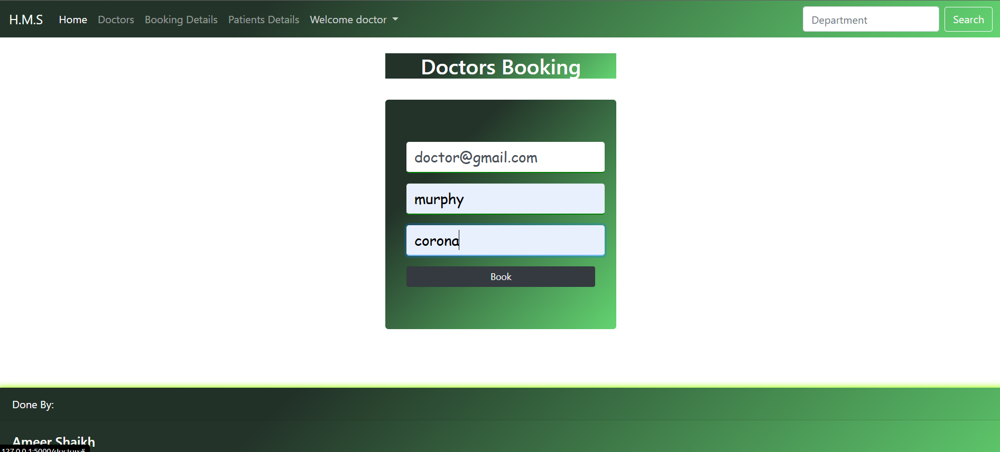
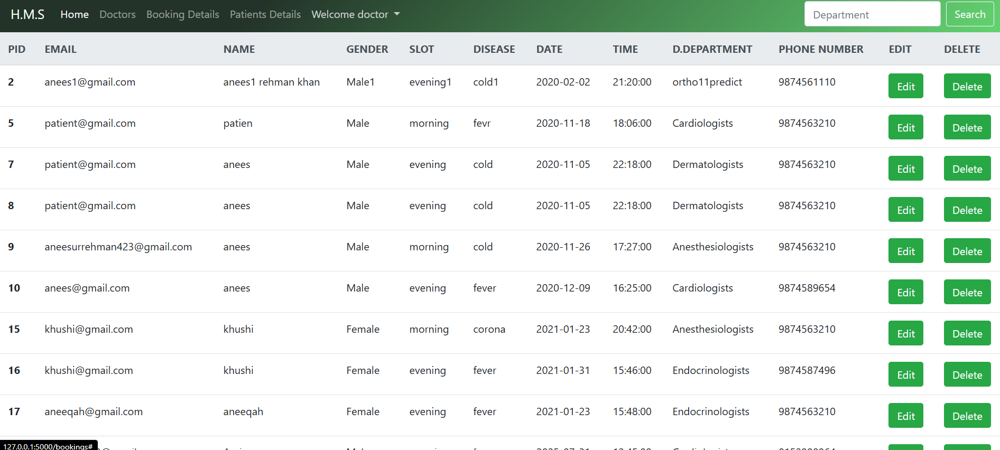

# 🏥 Hospital Management System

This is a web-based Hospital Management System built using **Flask** and **MySQL**. It allows users to manage patient bookings, view appointments, edit or delete entries, and handle hospital slot scheduling efficiently.

---

## 📌 Features

- Patient booking system
- View and manage all bookings
- Edit/Delete appointment records
- Slot, department, and time tracking

---

## 📂 Folder Structure

```
hospital-management/
├── static/
│   └── (CSS/JS files)
├── templates/
│   ├── base.html
│   ├── booking.html
│   └── other template files
├── app.py
├── hms.sql
├── README.md
```

---

## 💾 Requirements

Install Python dependencies using pip:

```bash
pip install -r requirements.txt
```

If you don’t have `requirements.txt`, install directly:

```bash
pip install flask mysql-connector-python
```

---

## 🛠️ Database Setup

1. **Start MySQL Server**
2. **Login to MySQL CLI**:

```bash
mysql -u root -p < hms.sql

---

## 🚀 Run the Flask App

Run the Python server using:

```bash
python app.py
```

Then visit:  
👉 http://127.0.0.1:5000/

---

## ✏️ Important Notes

- Template `booking.html` shows patient records in a table.
- Edit and delete buttons are available with confirmation prompts.
- Do **not** allow direct changes to the booking view template layout unless necessary for functional reasons.

---

## 🧪 Demo Screenshot






---

